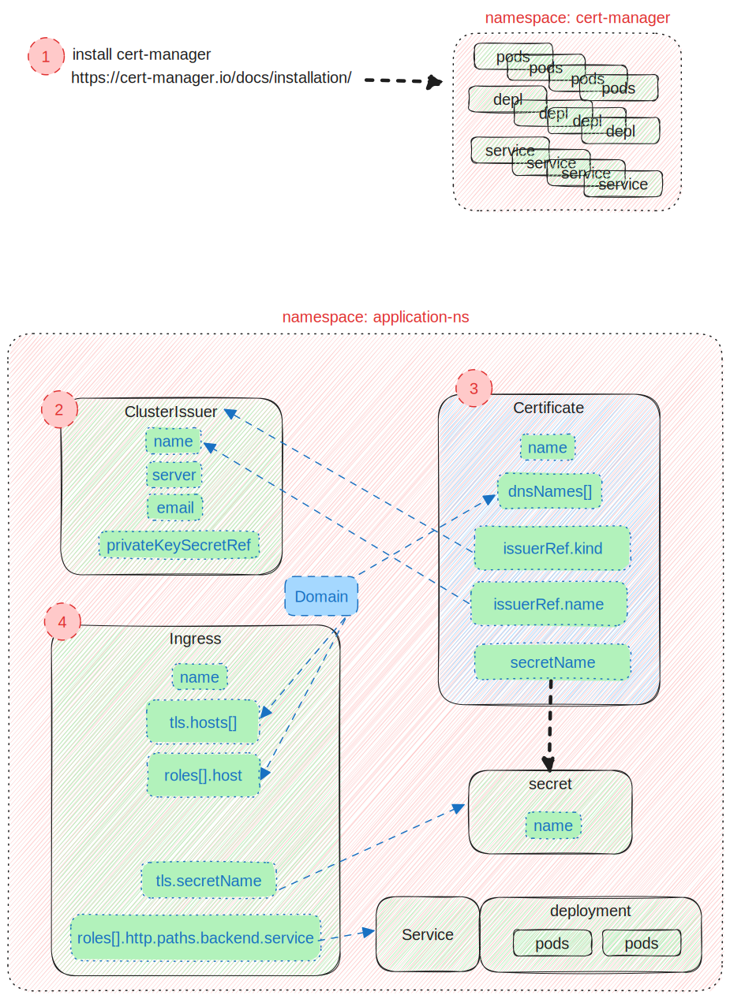

# Setting up SSL/TLS for Kubernetes Ingress using Cert-Manager

This repository provides a step-by-step guide and example Kubernetes manifests for setting up SSL/TLS for your Ingress resources using Cert-Manager on a Kubernetes cluster.

## Prerequisites

Before you begin, make sure you have the following prerequisites:

- A running Kubernetes cluster.
- `kubectl` installed and configured to access your cluster.

## Step-by-Step Guide

Follow these steps to set up SSL/TLS for Ingress on Kubernetes using Cert-Manager:

1. **Install Cert-Manager:**

    follow this  [istruction](https://cert-manager.io/docs/installation/) for more information
    The default static configuration can be installed as follows:

   ```bash
    kubectl apply -f https://github.com/cert-manager/cert-manager/releases/download/v1.13.1/cert-manager.yaml
   ```

2. **Create a Certificate Issuer:**

    Create a ClusterIssuer or Issuer resource to specify how Cert-Manager should obtain SSL/TLS certificates. You can use an ACME-based issuer (like Let's Encrypt) or another issuer of your choice.
    
    Example ClusterIssuer for Let's Encrypt:
   ```bash
    apiVersion: cert-manager.io/v1
    kind: ClusterIssuer
    metadata:
      name: <cluster-issuer-name>
      namespace: <namespace>
    spec:   
      acme:
        server: https://acme-v02.api.letsencrypt.org/directory
        email: <you-email-address>
        privateKeySecretRef:
          name: letsencrypt-cluster-issuer-key
        solvers:
        - http01:
           ingress:
             class: nginx
    ```
    Apply this YAML manifest using kubectl apply -f.
    
3. **Create a Certificate Resource:**

    Create a Certificate resource to request the SSL/TLS certificate for your domain. Specify the DNS name and reference the ClusterIssuer or Issuer you created earlier.
    
    Example Certificate:
   ```bash
    apiVersion: cert-manager.io/v1
    kind: Certificate
    metadata:
      name: <certificate-name>
      namespace: <namespace>
    spec:
      dnsNames:
        -  <domain>
      secretName: <secret-name>
      issuerRef:
        name: <cluster-issuer-name>
        kind: ClusterIssuer
    ```
    Apply this YAML manifest using kubectl apply -f.
     
4. **Create an Ingress Resource with TLS Configuration:**

    Create an Ingress resource for your application and specify the TLS configuration with the cert-manager.io/cluster-issuer annotation:
    
    Example Ingress:
   ```bash
    apiVersion: networking.k8s.io/v1
    kind: Ingress
    metadata:
      name: <ingress-name>
      namespace: <namespace>
      annotations:
        kubernetes.io/ingress.class: "nginx"
    spec:
      tls:
      - hosts:
        - <domain>
        secretName: <secret-name>
      rules:
      - host: <domain>
        http:
          paths:
          - path: /
            pathType: Prefix
            backend:
              service: 
                name: <service-name>
                port: 
                  number: <service-port>
    ```
    Apply this YAML manifest using kubectl apply -f.


    
    
    